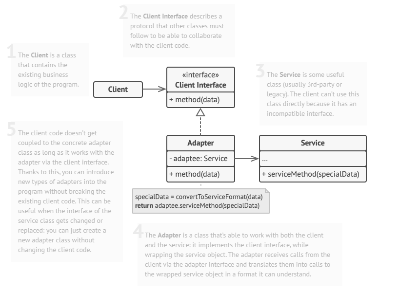

# Design Patterns with C#
A design pattern is a reusable solution for a recurring problem. In programming, knowing these and learning when to use them help to build better software.

This is the structure for a pattern definition:
- Name (Alias)
- Type
- Intent
- Context

## Adapter
**Type:** Structural \
**Intent:** To convert the interface of one class into an interface a client expects\
**Context:** Tries to solve incompatibility between interfaces of the client and the service provider 

## Factory
**Type:** Creational \
**Intent:** To provide creation of instantiation of other objects/interfaces
**Context:** 

## Abstract Factory

## Builder

